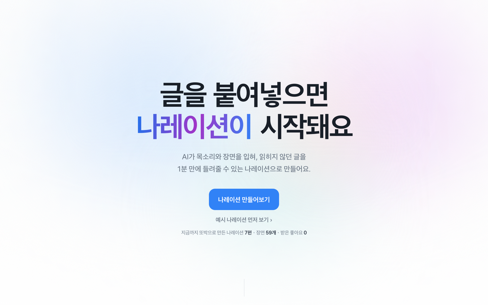
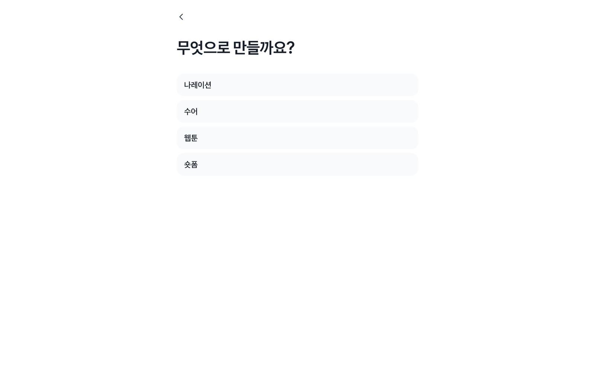
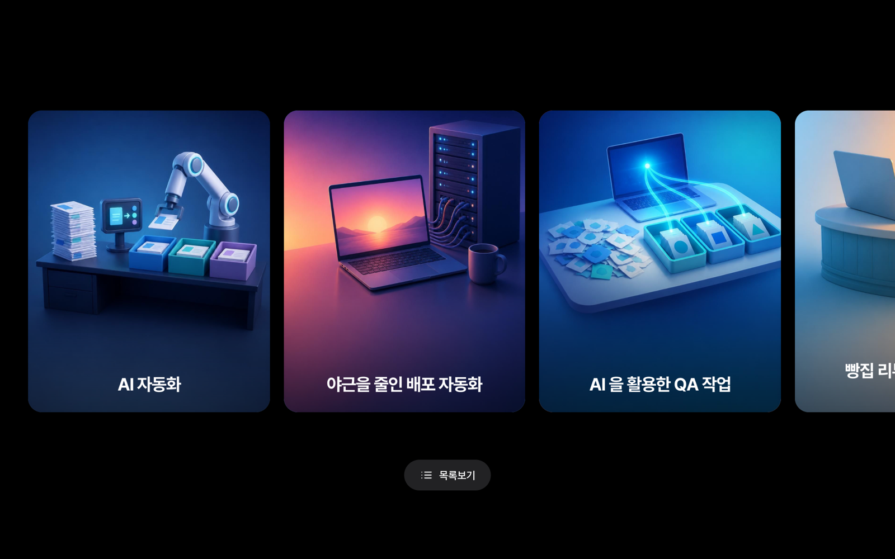
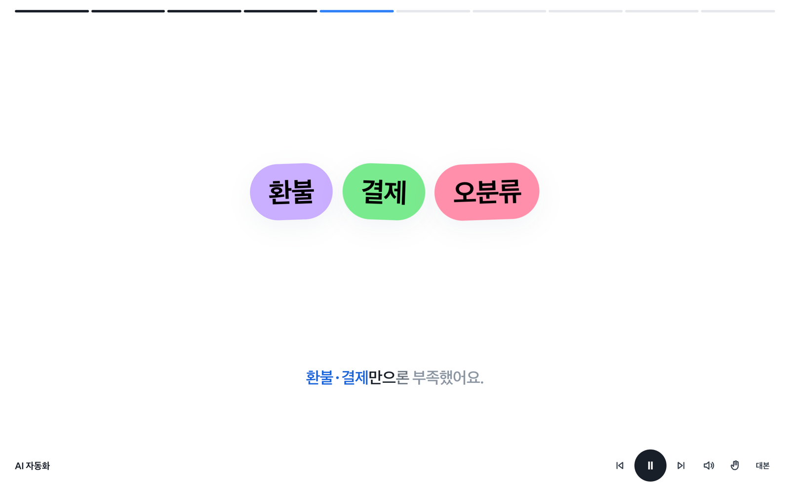
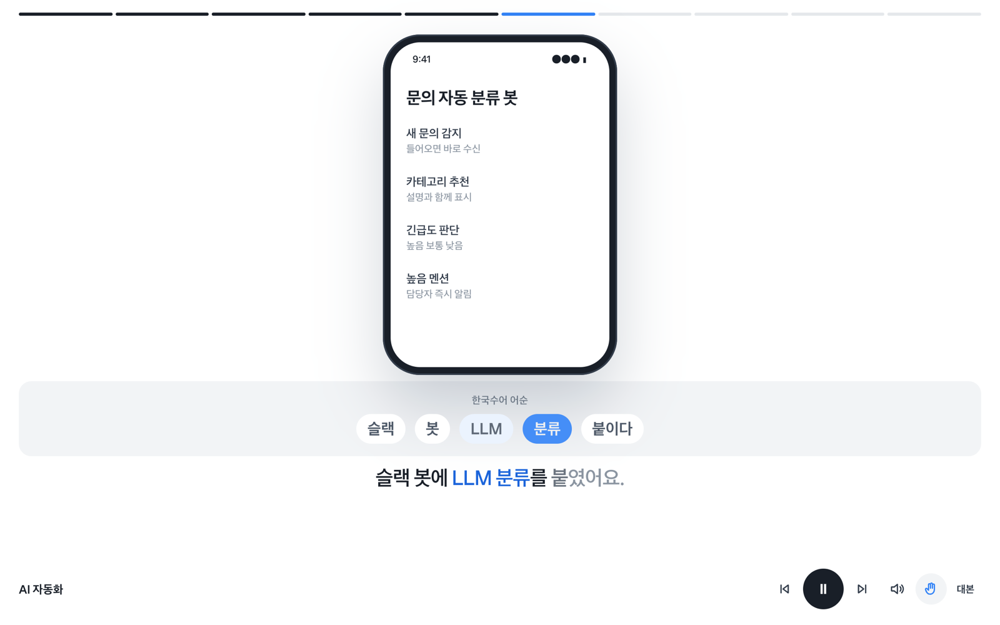
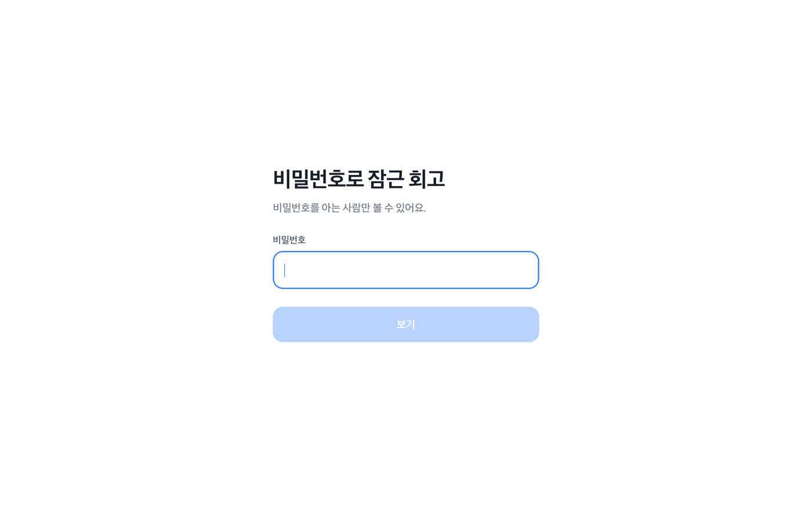

# 또박

**읽히지 않던 글을, 보고 듣는 나레이션으로.**

가게 소식, 수업 안내, 모임 후기, 업무 안내문 — 공들여 쓴 글은 많지만 끝까지 읽히는 일은 드뭅니다.
또박은 이미 써 둔 글 한 편을 붙여넣으면, 장면과 목소리가 있는 1분짜리 이야기로 바꿔 줍니다.
결과는 영상 파일이 아니라 링크 하나라서, 그대로 공유하고 바로 재생할 수 있습니다.

<https://ttobak.gogumang.com>



## 네 가지 형식 중에 고릅니다

같은 글로 만들어도 보여 주는 방식은 고를 수 있습니다.

| 형식 | 이런 화면이 나옵니다 |
|---|---|
| **나레이션** | 장면이 넘어가며 목소리가 읽어 주고, 자막이 말하는 속도에 맞춰 차오릅니다 |
| **수어** | 같은 나레이션에 한국수어 어순 자막을 켠 채로 재생합니다 |
| **웹툰** | 장면마다 그림 한 칸을 그려, 말풍선과 함께 세로로 읽어 내려갑니다 |
| **숏폼** | 세로 9:16 화면에 큰 자막으로, 탭하며 짧게 넘깁니다 |



## 어떻게 쓰나요

1. **형식 고르기** — 나레이션 · 수어 · 웹툰 · 숏폼
2. **종류 고르기** — 문제 해결 사례, 프로젝트 소개, 회고·후기, 기술 설명, 튜토리얼
3. **글 붙여넣기** — 글을 그대로 넣거나, 블로그·깃허브 주소만 넣어도 본문과 이미지를 가져옵니다
4. **길이와 목소리 고르기** — 짧게·보통·자세히, 목소리 여섯 가지 중에서
5. **공개 범위 고르기** — 모두에게 보여 줄지, 비밀번호를 아는 사람만 볼지
6. **기다리기** — 대본, 장면, 목소리, 표지 그림이 한꺼번에 만들어집니다 (보통 20초 남짓, 웹툰은 그림을 그리느라 1분쯤)

만들어진 이야기는 링크 하나로 공유되고, 공개로 만든 것은 메인 아래 모음에서 서로 볼 수 있습니다.



## 무엇이 만들어지나요

- **장면** — 문장마다 어울리는 화면을 골라 붙입니다. 큰 제목, 올라가는 숫자, 키워드, 앱 화면, 대화, 발표자, 올린 사진
- **목소리와 자막** — 장면마다 나레이션을 녹음하고, 말하는 속도에 맞춰 자막이 한 단어씩 차오릅니다



- **표지 그림** — 제목을 읽고 무엇을 그릴지 먼저 정한 뒤, 그 장면을 그립니다. 글자는 넣지 않습니다
- **화자 얼굴** — 사진을 올리지 않으면, 이야기를 들려주는 인물을 그려 넣습니다
- **웹툰 칸** — 웹툰으로 만들면 장면마다 같은 그림체·같은 인물로 칸을 이어 그립니다
- **한국수어 어순 자막** — 문장을 한국수어의 어순과 어휘로 옮겨, 나레이션에 맞춰 한 단어씩 짚어 줍니다



## 공유와 공개 범위

- **링크 복사** — 화면에서 바로 주소를 복사합니다. 붙여넣으면 표지 그림이 담긴 미리보기가 뜹니다
- **공개** — 메인 아래 모음에 실려서 누구나 볼 수 있습니다
- **비공개** — 모음에 싣지 않고, 링크로 들어와도 비밀번호를 넣어야 열립니다.
  비밀번호는 소금과 함께 해시로만 저장하고 원문은 어디에도 남기지 않습니다



## 지켜야 할 것으로 삼은 것

- **없는 숫자는 쓰지 않습니다.** 화면에 크게 뜨는 숫자가 원문에 없으면 그 장면을 다른 장면으로 바꿉니다
- **읽는 사람에게 선택권을 줍니다.** 장면을 건너뛰거나, 소리를 끄거나, 원하는 형식으로 볼 수 있습니다
- **수어는 통역 영상이 아닙니다.** 어순 자막이라고 분명히 밝히고, 농인 당사자 검증은 따로 진행합니다
- **동작 줄이기를 켠 사람에게는** 움직임 없이 같은 내용을 보여 줍니다

## 직접 돌려보려면

`.env.example` 을 `.env.local` 로 복사해 키를 채우고 개발 서버를 실행하세요.
배포 설정은 `docs/deploy.md`, 폴더 구조는 `docs/architecture.md`, 데이터베이스 준비는 `supabase/schema.sql` 을 보면 됩니다.

```bash
pnpm install
pnpm dev
```
